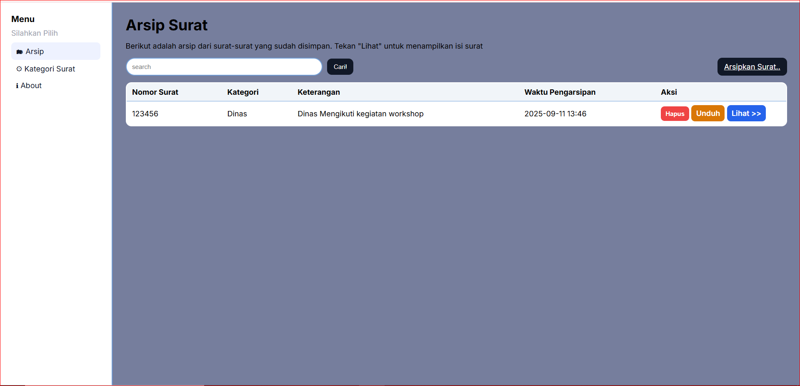
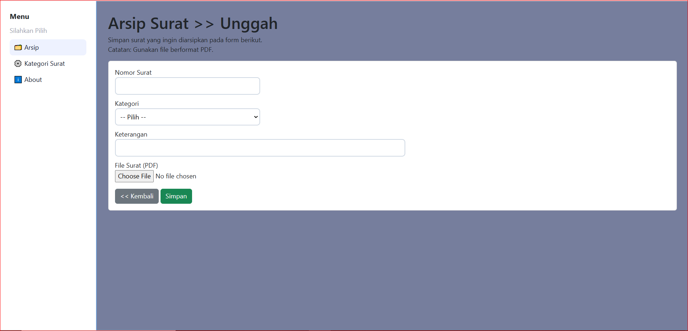
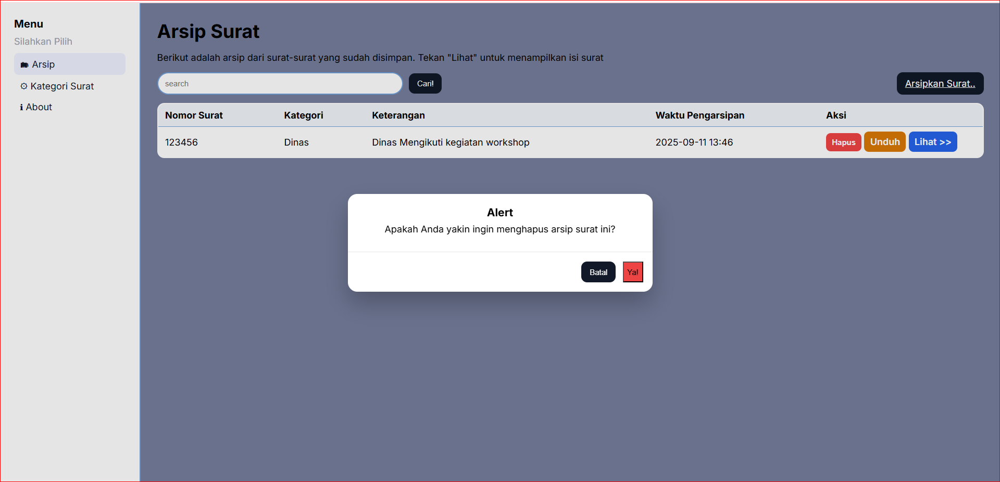
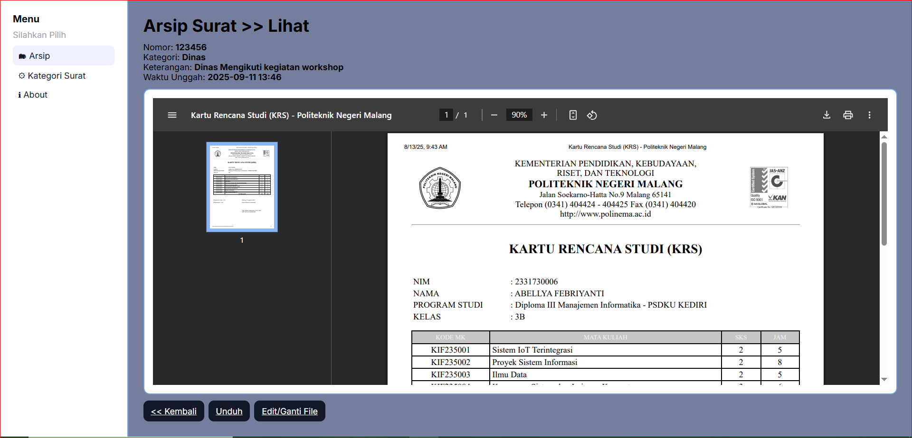
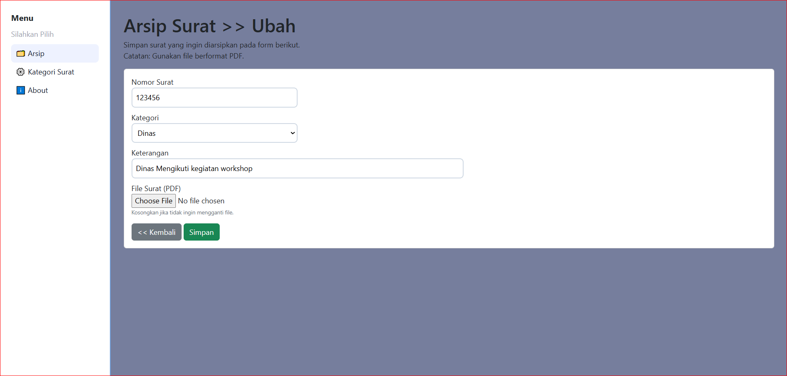
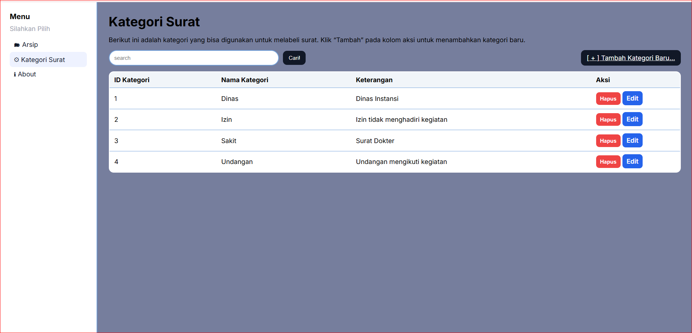
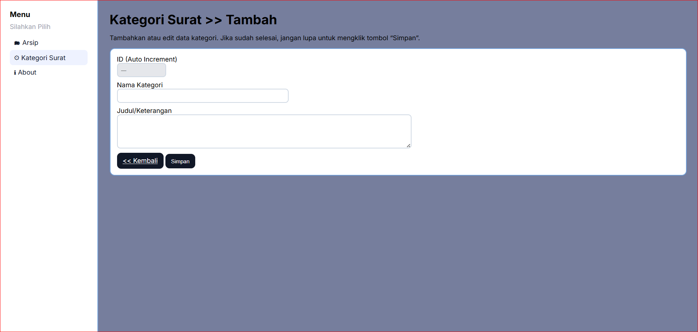

APLIKASI ARSIP SURAT 

Tujuan
Membantu dalam menyimpan, mengelola, dan mencari surat resmi dalam format PDF, sehingga lebih efisien dan mudah diakses.

Fitur
- Upload surat resmi dalam format PDF.
- Pencarian surat berdasarkan judul.
- Unduh surat yang telah diarsipkan.
- Manajemen kategori surat.

Cara Menjalankan
- lakukan php artisan migrate untuk membuat tabel bawaan laravel
- lakukan php artisan storage:link untuk membuat link dari folder public dan storage
- download dan pasang arsip_surat.sql dari repo GitHub
- lakukan php artisan serve untuk menjalankan laravel

Screenshot
Arsip

Kategori Surat

About

